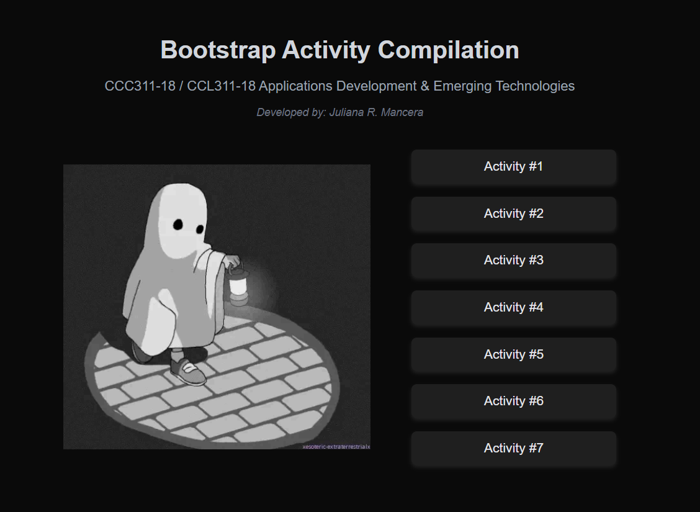

# AppDev_Bootstrap_Activities

## Prerequisites
Before you begin, ensure you have the following installed on your system:
- [Visual Studio Code (VS Code)](https://code.visualstudio.com/)
- [Laragon](https://laragon.org/)
- PHP (included with Laragon)
- VS Code PHP extension (e.g., PHP Intelephense or PHP Debug)

## Setting Up Laragon
1. **Download and Install Laragon**:
   - Go to [Laragon's official website](https://laragon.org/) and download the latest version.
   - Install and launch Laragon.

2. **Start Laragon Services**:
   - Open Laragon and click **Start All** to run Apache and MySQL.
   - Ensure Laragon is running by visiting `http://localhost` in your browser.

## Configuring VS Code for PHP
1. **Install PHP Extension**:
   - Open VS Code.
   - Go to **Extensions (Ctrl + Shift + X)**.
   - Search for "PHP Intelephense" and install it.

2. **Set the PHP Executable Path**:
   - Open VS Code **Settings (Ctrl + ,)**.
   - Search for `php.executablePath`.
   - Set the value to Laragon's PHP path, typically:
     ```json
     "php.executablePath": "C:/laragon/bin/php/php-8.x.x-Win/php.exe"
     ```
     (Replace `8.x.x` with your installed PHP version.)

## Running PHP Scripts
### Using VS Code Terminal
1. Open your PHP project folder in VS Code.
2. Open the **Terminal (Ctrl + `)**.
3. Run the following command:
   ```sh
   php -S localhost:8000
   ```
4. Open your browser and go to `http://localhost:8000/your_script.php`.

### Using Laragon's Virtual Host
1. Place your PHP files inside `C:/laragon/www/`.
2. Open Laragon and click **Menu > Apache > Reload**.
3. Open your browser and access the script at `http://localhost/your_script.php`.

## Running Your Activities
If your activities are stored in folders like `Activity #1`, `Activity #2`, etc.:
1. Move them to `C:/laragon/www/`.
2. Open your browser and navigate to `http://localhost/Activity1/` (replace with the correct folder name).

## Expected Output

If you successfully run the Bootstrap Activity Compilation, you should see an output similar to this:


## Troubleshooting
- If you get an error, make sure Laragon is running.
- Check the PHP version by running:
  ```sh
  php -v
  ```
- Ensure your script files have the `.php` extension.


